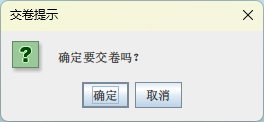
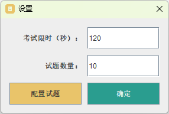
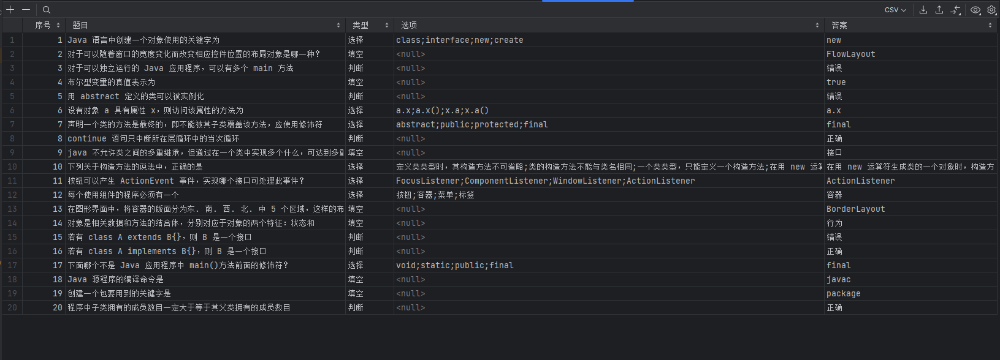

# 《测验系统》使用文档

> 来自 Java 课程项目

## 系统说明

这是一个组卷、考试及评卷系统，支持的功能包括：

- 使用文本文件或 Microsoft Excel 或者数据库存放试题，形成题库。 
- 程序每次从题库随机抽取若干道题目形成一张试卷，用户可以依次做试卷上的题目， 允许用户向前、向后翻阅试卷上的题目。
- 用户每次做完一个题目必须确定该题目的答案，否则无效。
- 有计时功能，比如指定一张试卷限用时 15 分钟，时间一到用户再无法答题，提示用 户提交试卷。
- 用户一旦提交试卷，程序将给出试卷的分值。
- 为了达到反复训练的目的，用户提交试卷后可以继续让程序再出一套试卷。
- 题型可以包括单项选择题或判断题或填空题等。
- 每套试卷及其标准答案可以单独保存。

### 运行环境

Java 运行时：JDK / OpenJDK 20

**直接运行 TestProgram.jar 即可打开 GUI 程序。**

必要资源：需要保持 resources 文件夹与 jar 文件在同一工作路径下。

## 操作说明

### 主界面

主界面有三个按钮，提供的功能包括：

- “开始测试”按钮：进入答题页面
- “历史记录”按钮：打开已保存试卷存放的文件夹
- “设置”按钮：配置测试信息

### 答题界面

#### 加载页面

在此页面下，程序会异步加载试题、随机组卷以及绘制题目卡片。用户只需稍作等待即可进入答题。

#### 开始答题

正式的答题页面包含三种类型的题目卡片：单项选择、判断和填空。

页面能够划分为四个部分：

- 顶栏：展示了当前题目在试卷中的序号、题目的类型以及剩余的答题时间。
- 左右切换按钮：用户能够随意切换上/下一题目。
- 中间的答题卡片：用户在这一区域完成答题，并且通过点击“确定”按钮确定答案。已确定答案的题目下，“确定”按钮会变为稍淡的颜色以提示用户（如图3）。
- 底栏：展示了已完成和确定答案的题目数量，并且允许用户能够直接交卷。

点击“交卷”按钮会触发提示框：

#### 结果页面

交卷后（包括用户主动交卷和答题时间耗尽后的强制交卷），程序进入测验结果页面。

此页面会展示用户的得分。用户可以选择导出此次试题的所有信息，以及返回主界面。

### 历史记录

用户点击“历史记录”按钮后，程序会打开资源管理器展示所有保存的试卷信息。记录保存的格式为 txt 纯文本文件，使用记事本即可打开。

### 设置

在设置界面，用户能够修改考试限制的用时和包含的试题数量。点击“确定”按钮即可保存设置信息。

点击“配置试题”按钮，程序会打开题库配置文件。题库文件采用以 , 为分隔符的 csv 纯文本表格文件，使用记事本或 Excel 软件即可轻松编辑。

题库中的题目信息包括：

- 序号：题目序号。
- 题目：题面信息。
- 类型：可填项为选择/判断/填空。
- 选项：仅适用于选择题。不同的选项使用英文分号 ; 分隔。
- 答案：答案全文。对于判断题，可填项为正确/错误。
